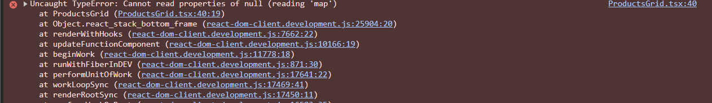

# Debugging Exercise: Three Planted Bugs, Three Tools

Sample component — a task list fetching from an API. Three bugs, planted on purpose, each one matched to the tool that's actually built to find it.

```tsx
// TaskList.tsx — buggy version
import { useState, useEffect } from "react";

interface Task {
  id: number;
  title: string;
}

function TaskItem({ title }: { title: string }) {
  return <li>{title}</li>; // BUG 2 lives here — see below
}

export default function TaskList() {
  const [tasks, setTasks] = useState(null); // BUG 1 lives here

  useEffect(() => {
    fetch("http://localhost:3000/api/tsaks") // BUG 3 lives here
      .then((res) => res.json())
      .then(setTasks)
      .catch((err) => console.error(err));
  }, []);

  return (
    <ul>
      {tasks.map((t) => (
        <TaskItem key={t.id} taskTitle={t.title} />
      ))}
    </ul>
  );
}
```

---

## Bug 1 — Crash: `.map()` on null state

**Symptom:** white screen on load, console shows `TypeError: Cannot read properties of null (reading 'map')`.

**Tool: breakpoint (Sources tab)**
1. Open your React application in the browser.
2. Press F12 or Ctrl+Shift+I to open Developer Tools
3. Press Ctrl+P to find `TaskList.tsx`, click the line number on `tasks.map(...)` to set a breakpoint.
4. Reload. Execution pauses right before the crash.
5. Hover `tasks` in the paused frame (or check it in the Scope panel) — it's `null`. That's the whole bug: initial state was never a valid array.

**Fix**
```tsx
const [tasks, setTasks] = useState<Task[]>([]);
```
A breakpoint earns its keep here specifically because the error message alone tells you *where* it crashed but not *why* — you need to inspect the actual value in memory at that moment, and that's what a paused frame gives you that a stack trace doesn't.

---



## Bug 2 — Silent wrong value: prop name typo

**Symptom:** no crash, no console error — the list just renders empty `<li>` elements.

**Tool: React DevTools (Components tab)**
1. Open the Components panel, select a `TaskItem` in the tree.
2. Look at the props panel on the right: `taskTitle: "Buy milk"`, but the component destructures `title` — so `title` is `undefined`.
3. The mismatch is visible the instant you compare what's passed against what's read, which is exactly what console.log-sprinkling is bad at and DevTools is built for.

**Fix**
```tsx
<TaskItem key={t.id} title={t.title} />
```

---

## Bug 3 — Network failure: mistyped URL

**Symptom:** tasks never load; if the `.catch()` weren't there it'd also throw on `res.json()` of an HTML error page.

**Tool: Network tab**
1. Open Network, reload, filter to Fetch/XHR.
2. See the request to `/api/tsaks` — status `404`, red row.
3. The URL itself, spelled out in the request row, is the fastest way to catch a typo — faster than re-reading your own source line by line.

**Fix**
```tsx
fetch("/api/tasks")
```

---


